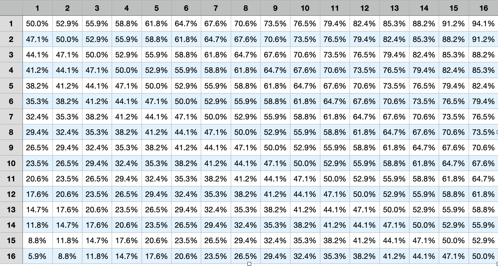

# bracket-randomizer
A tool that randomly generates a March Madness bracket for the 2021 season.

The outcome of each game is randomly determined by weighting the seed's of the teams playing in it.

The probabilty of a team winning a game is:

(8.5 + (SEED OF TEAM - SEED OF OPPONENT) / 2) / 17.

The formula generates the following outcomes:

The app will log the results of games for each round to the console.

To run the app type `node index.js`